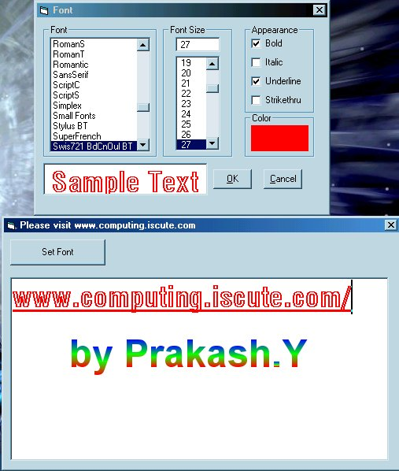



## Add your own font dialog to your Apps\!

### Description

This is an good example of Selection font dialog box. Which includes, Bold, italic, underline, font color, Font soze, Font name, etc.. Best one!

thanks from Prakash.Y Please vote for me.
 
### More Info
 

             |
---                |---
**Submitted On**   |2001-11-24 20:00:34
**By**             |[TheCodeGuru](https://github.com/Planet-Source-Code/PSCIndex/blob/master/ByAuthor/thecodeguru.md)
**Level**          |Intermediate
**User Rating**    |3.8 (15 globes from 4 users)
**Compatibility**  |VB 5\.0, VB 6\.0
**Category**       |[Files/ File Controls/ Input/ Output](https://github.com/Planet-Source-Code/PSCIndex/blob/master/ByCategory/files-file-controls-input-output__1-3.md)
**World**          |[Visual Basic](https://github.com/Planet-Source-Code/PSCIndex/blob/master/ByWorld/visual-basic.md)
**Archive File**   |[Add\_your\_o3717911242001\.zip](https://github.com/Planet-Source-Code/thecodeguru-add-your-own-font-dialog-to-your-apps__1-29175/archive/master.zip)

